# Infrastructure Hybride — Pipeline de Streaming de Tickets Client

## Contexte

Ce projet simule une infrastructure hybride combinant des ressources **on-premise** et **cloud AWS**. Il met en place un pipeline de données en temps réel capable de générer, transporter et traiter des flux de tickets de support client de manière continue.

L'architecture locale (dockerisée) illustre la couche d'ingestion et de traitement streaming, tandis que le diagramme d'architecture décrit l'infrastructure cible complète en production sur AWS.

---

## Objectifs

- Simuler la production de tickets de support client en continu
- Transporter les événements via un broker de messages compatible Kafka (Redpanda)
- Consommer et enrichir les données en temps réel avec Apache Spark Structured Streaming
- Persister les données traitées au format JSON
- Illustrer une architecture hybride on-premise / cloud AWS réaliste

---

## Diagramme du pipeline

```mermaid
---
config:
  layout: elk
---
flowchart LR
 subgraph onprem["On-premise"]
        sql["SQL Server<br><small>ERP / CRM</small>"]
        san["SAN<br><small>Logs, fichiers, IoT</small>"]
        ad["Active Directory<br><small>Gestion des identités</small>"]
  end
 subgraph ingestion["Ingestion & Streaming"]
        redpanda["Redpanda<br><small>Ingestion des flux IoT en temps réel<br>Transport via protocoles Kafka API</small>"]
  end
 subgraph traitement["Traitement"]
        spark["Apache Spark — AWS EMR<br><small>Nettoyage · Transformation · Enrichissement<br>Batch et streaming</small>"]
  end
 subgraph stockage["Stockage"]
        s3["Amazon S3 — Data Lake<br><small>Données brutes (raw) · Données transformées<br>Formats Parquet, JSON, CSV</small>"]
  end
 subgraph analyse["Analyse"]
        redshift["Amazon Redshift — Entrepôt de données<br><small>Requêtes analytiques SQL</small>"]
  end
 subgraph integration["Intégration SI"]
        dms["AWS DMS<br><small>Synchronisation SQL Server → Redshift / S3<br>Réplication continue (CDC)</small>"]
  end
 subgraph securite["Sécurité"]
        iam["AWS IAM + AWS Directory Service<br><small>Intégration Active Directory<br>Gestion centralisée des accès</small>"]
  end
 subgraph cloud["AWS Cloud"]
    direction TB
        ingestion
        traitement
        stockage
        analyse
        integration
        securite
  end
    onprem --> vpn["Connexion sécurisée — VPN IPSec / AWS Direct Connect"]
    vpn --> ingestion
    ingestion --> traitement
    traitement --> stockage
    stockage --> analyse
    analyse --> integration
    integration --> securite

     sql:::onprem
     san:::onprem
     ad:::onprem
     redpanda:::ingestion
     spark:::traitement
     s3:::stockage
     redshift:::analyse
     dms:::integration
     iam:::securite
```



---

## Architecture locale (implémentation Docker)

Le projet déploie 3 services via Docker Compose :

```
Producer (Python)
      │
      │  JSON via Kafka API
      ▼
Redpanda (broker Kafka-compatible)
      │  topic: client_tickets
      ▼
Apache Spark Structured Streaming
      │
      ▼
data/output/tickets_agg_json/  (fichiers JSON)
```

| Service | Image / Base | Rôle |
|---|---|---|
| `redpanda` | `redpandadata/redpanda:latest` | Broker de messages, API Kafka sur le port 9092 |
| `producer` | `python:3.10` | Génère des tickets aléatoires toutes les 2 secondes |
| `spark` | `apache/spark:3.5.0` | Consomme le topic, enrichit les données, écrit en JSON |

---

## Composants détaillés

### 1. Producer (`producer/producer_tickets.py`)

Génère des tickets de support client synthétiques et les publie dans Redpanda via l'API Kafka.

**Champs générés par ticket :**

| Champ | Description | Exemple |
|---|---|---|
| `ticket_id` | Identifiant unique UUID | `"a3f2c1d0-..."` |
| `client_id` | Identifiant client aléatoire | `"C4821"` |
| `created_at` | Horodatage de création | `"2026-05-08 14:32:01"` |
| `demande` | Nature de la demande | `"Erreur paiement"` |
| `type_demande` | Catégorie du ticket | `"Facturation"` |
| `priorite` | Niveau de priorité | `"Critique"` |

**Types de demandes possibles :** Technique · Facturation · Compte · Livraison  
**Niveaux de priorité :** Faible · Moyenne · Haute · Critique  
**Fréquence d'envoi :** 1 ticket toutes les 2 secondes

---

### 2. Redpanda (`docker-compose.yml`)

Redpanda est un broker de messages **compatible avec l'API Kafka**, mais plus rapide et plus simple à déployer (pas de dépendance ZooKeeper).

- Écoute sur le port `9092` (protocole Kafka)
- Topic utilisé : `client_tickets`
- Configuré en mode single-node pour l'environnement local (`--smp 1`, `--memory 1G`)

---

### 3. Spark Structured Streaming (`spark/spark_ticket_processing.py`)

Consomme les messages du topic `client_tickets` en temps réel et applique une logique d'enrichissement.

**Étapes de traitement :**

1. **Lecture** du flux Kafka depuis Redpanda (`startingOffsets: latest`)
2. **Désérialisation** JSON des messages bruts
3. **Enrichissement** : ajout d'une colonne `equipe_support` selon le type de demande :

| `type_demande` | `equipe_support` assignée |
|---|---|
| Technique | Support Technique |
| Facturation | Support Facturation |
| Livraison | Support Livraison |
| Compte | Support Compte |
| Autre | Support Général |

4. **Écriture** en mode `append` au format JSON dans `data/output/tickets_agg_json/`
5. **Checkpointing** dans `checkpoints/tickets_agg_json/` pour garantir la reprise en cas d'arrêt

---

## Format des données

### Message entrant (Redpanda → Spark)

```json
{
  "ticket_id": "a3f2c1d0-5e6f-7a8b-9c0d-1e2f3a4b5c6d",
  "client_id": "C4821",
  "created_at": "2026-05-08 14:32:01",
  "demande": "Erreur paiement",
  "type_demande": "Facturation",
  "priorite": "Haute"
}
```

### Message enrichi (sortie Spark)

```json
{
  "ticket_id": "a3f2c1d0-5e6f-7a8b-9c0d-1e2f3a4b5c6d",
  "client_id": "C4821",
  "created_at": "2026-05-08 14:32:01",
  "demande": "Erreur paiement",
  "type_demande": "Facturation",
  "priorite": "Haute",
  "equipe_support": "Support Facturation"
}
```

---

## Prérequis

- [Docker](https://www.docker.com/) et Docker Compose installés
- Au moins **4 Go de RAM** disponibles pour les conteneurs

---

## Installation et démarrage

### 1. Cloner le dépôt

```bash
git clone https://github.com/ENDAYEaime/project_infra_hybride.git
cd project_infra_hybride
```

### 2. Lancer tous les services

```bash
docker-compose up --build
```

Les services démarrent dans cet ordre :
1. **Redpanda** — le broker doit être prêt avant les autres
2. **Producer** — commence à envoyer des tickets dès que Redpanda est disponible
3. **Spark** — se connecte à Redpanda et commence le traitement en streaming

### 3. Vérifier les logs

```bash
# Voir les tickets envoyés par le producer
docker logs producer -f

# Voir le traitement Spark
docker logs spark -f
```

### 4. Consulter les données de sortie

Les tickets enrichis sont écrits dans :

```
data/output/tickets_agg_json/
```

### 5. Arrêter les services

```bash
docker-compose down
```

---

## Structure du projet

```
project_infra_hybride/
│
├── producer/
│   ├── Dockerfile                  # Image Python 3.10
│   ├── producer_tickets.py         # Générateur de tickets Kafka
│   └── requirements.txt
│
├── spark/
│   ├── Dockerfile                  # Image Apache Spark 3.5.0
│   ├── spark_ticket_processing.py  # Job Spark Structured Streaming
│   └── requirements.txt
│
├── data/
│   └── output/
│       └── tickets_agg_json/       # Données enrichies (sortie Spark)
│
├── checkpoints/
│   └── tickets_agg_json/           # Checkpoints Spark (reprise à chaud)
│
├── docker-compose.yml              # Orchestration des services
└── README.md
```

---

## Technologies utilisées

| Technologie | Version | Rôle |
|---|---|---|
| Python | 3.10 | Langage du producer |
| kafka-python | latest | Client Kafka pour le producer |
| Redpanda | latest | Broker de messages (API Kafka) |
| Apache Spark | 3.5.0 | Traitement streaming (Structured Streaming) |
| spark-sql-kafka | 3.5.0 | Connecteur Spark ↔ Kafka |
| Docker / Compose | - | Conteneurisation et orchestration |

---

## Architecture cible AWS (production)

En production, ce pipeline s'inscrit dans une architecture hybride complète :

| Couche | Service AWS | Rôle |
|---|---|---|
| Ingestion | Redpanda (sur EC2 ou EKS) | Transport des flux temps réel |
| Traitement | Apache Spark sur AWS EMR | Nettoyage, transformation, enrichissement |
| Stockage | Amazon S3 | Data Lake (raw + transformé) |
| Analyse | Amazon Redshift | Entrepôt de données, requêtes SQL analytiques |
| Intégration SI | AWS DMS | Réplication CDC depuis SQL Server on-premise |
| Sécurité | AWS IAM + Directory Service | Gestion des accès, intégration Active Directory |
| Connectivité | VPN IPSec / AWS Direct Connect | Liaison sécurisée on-premise ↔ cloud |
